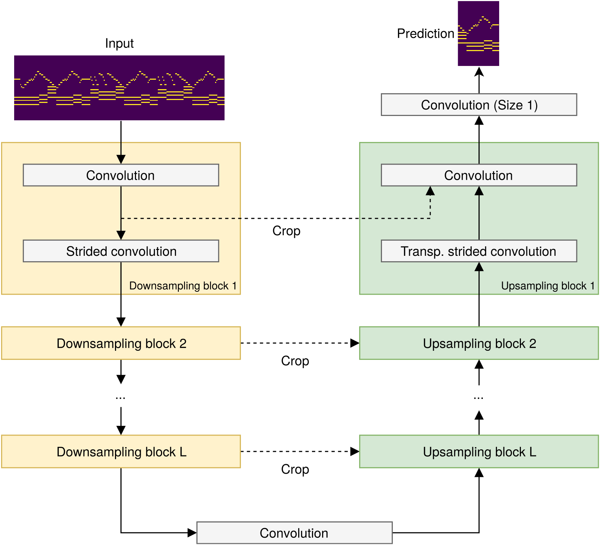

# Seq-U-Net: A causal one-dimensional U-Net for sequence modelling

This is the official repository for the Seq-U-Net.

## What is the Seq-U-Net?

Like the Wavenet and TCN, the Seq-U-net is a convolutional neural network for auto-regressive sequence modelling - 
it predicts the probability of the output at time t given a fixed window of length k of previous samples at time t-k to t-1.

Wavenet and TCN use dilated convolutions that need to be computed at every time-step, which needs a lot of memory and compute time.
But many high-level features of interest should only vary slowly over time (such as chords in a music piece) compared to the sequence's temporal resolution.
Based on this "slow feature hypothesis", we adapt a U-net architecture that resamples features to process them at different temporal resolutions:



Note that the convolutions are all 1D, similar to the [Wave-U-Net](http://www.github.com/f90/Wave-U-Net).

This results in a much sparser set of feature activations that has to be computed and kept in memory:


We find that the Seq-U-Net uses significantly less memory and compute time across a variety of tasks (text and music generation),
while delivering very similar performance compared to Wavenet and TCN.

Audio examples can be found [here](raw_audio/generated_samples)

## Installation

System requirements are as follows:

* Python 3.6
* [Soundfile](http://www.mega-nerd.com/libsndfile/) library installed
* Virtualenv strongly recommended
* GPU strongly recommended for higher training speed

Once you have the above, clone the Github repository:

```
git clone https://github.com/f90/Seq-U-Net.git
```

Create a new virtual environment to install the required Python packages into, e.g. by doing

```
virtualenv --python /usr/bin/python3.6 sequnet-env
```

Then activate the virtual environment:

```
source sequnet-env/bin/activate
```

And install all the required packages listed in the ``requirements.txt``:

```
pip3 install -r requirements.txt
```

Now you are ready to run the experiments as they were performed in the paper!

## Running the experiments

Each task/experiment has its own subfolder in this repository, with shared code being in the main folder, such as the network architecture of the TCN and Seq-U-Net.

For information on each task and how to train models for it, go to the respective subfolder in this repository and consult the ``README.md`` therein.